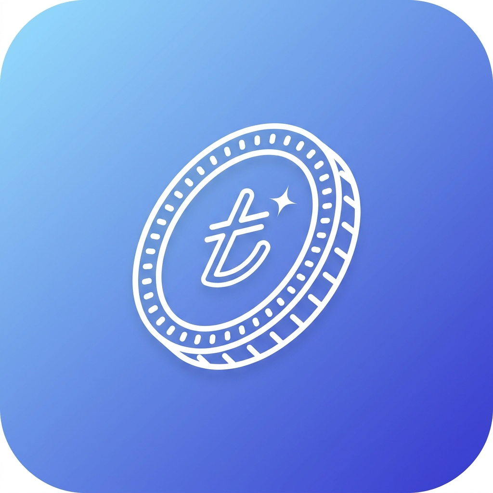

# 💙 Akçe

**Aboneliklerini ve harcamalarını tek bir yerde topla, paranın nereye gittiğini net gör.**

Mobil öncelikli, telefonuna kurulabilen (PWA), verilerin tamamen sende kalan kişisel abonelik & maliyet takip uygulaması.

---

## ✨ Neler yapabilir?

- 💳 **Abonelik takibi** — fiyat, ad, gerçek marka logosu ve görselle şık "fiyat kartları".
- 📅 **Nakit akışı takvimi** — ayın hangi günü ne kadar para çıkacağını tek bakışta gör.
- 🧾 **Taksit takibi** — kaçıncı ayda olduğunu her ay tarihe göre otomatik ilerletir.
- 🆓 **Deneme (trial) modu** — denemeler toplam maliyete yansımaz, bitişe yakın seni uyarır.
- 💱 **Canlı döviz kuru** — yabancı abonelikleri TL karşılığıyla gösterir (internet yoksa son kuru kullanır).
- 📊 **Akıllı analiz** — bu ay vs. geçen ay, yüzde değişim ve sebebini açıklayan kısa yorum.
- 🎉 **Yıl sonu "Wrapped"** — toplam harcama, en pahalı abonelik ve biriktirdiğin tutar.
- 🔍 **Çeyreklik denetim** — kullanılmayan/zamlanan abonelikleri öne çıkarır.
- 🔔 **Bildirimler** — yaklaşan ödemeler, deneme bitişleri ve denetim hatırlatmaları.
- 🌙 **Mavi tema + karanlık mod** — yumuşak, modern, native mobil his.
- 🔒 **Gizlilik** — tüm veriler cihazında (IndexedDB) tutulur, dışa/içe JSON yedeği alınabilir.

---

## 📁 Proje yapısı

| Dosya | Açıklama |
|------|----------|
| `index.html` | Tek sayfa uygulama arayüzü |
| `style.css` | Mobil öncelikli tema ve bileşen stilleri |
| `app.js` | IndexedDB, analiz, form akışları, grafikler, bildirimler, import/export |
| `manifest.json` | PWA manifest ayarları |
| `sw.js` | Offline cache ve uygulama kabuğu (service worker) |
| `data/catalog.json` | Yerel servis kataloğu (Trendyol, Hepsiburada, Netflix vb.) |
| `assets/icons/*` | Uygulama ikonları |

---

## 🚀 Yerelde çalıştırma

Statik bir sunucuyla aç:

python3 -m http.server 4173

Sonra tarayıcıdan **http://localhost:4173** adresine git.

> 💡 PWA özelliklerinin (kurulum, service worker) düzgün çalışması için dosyaları çift tıklayarak değil, bir sunucu üzerinden açman önerilir.

---

## 🌐 Ücretsiz yayınlama

Proje tamamen statik olduğu için aşağıdaki servislerle **bedava** yayınlanabilir:

- **GitHub Pages** — depoyu GitHub'a gönder, `Settings → Pages` altından ana branch'i seç. *(Public repo ile ücretsiz.)*
- **Netlify** — klasörü sürükle-bırak ya da Git deposuna bağla.
- **Vercel** — `Other` / `Static` proje olarak bağla.
- **Cloudflare Pages** — Git deposunu bağla, build gerektirmez.

---

## 📲 Telefona ekleme

| Platform | Adımlar |
|----------|---------|
| **Android (Chrome)** | Siteyi aç → menü → **Ana ekrana ekle** |
| **iPhone (Safari)** | Siteyi aç → Paylaş → **Ana Ekrana Ekle** |

İlk açılışta service worker cache oluştuktan sonra uygulama **internet olmadan da** açılır. Canlı döviz kuru gibi özellikler internet olduğunda güncellenir.

---

## 🔐 Gizlilik

Akçe hiçbir veriyi sunucuya göndermez. Tüm aboneliklerin, taksitlerin ve harcama geçmişin **yalnızca senin cihazında** saklanır. Yedeklemek istersen tek tuşla JSON olarak dışa aktarabilir, başka bir cihazda içe aktarabilirsin.

---

## 🛠️ Teknoloji

Saf **HTML + CSS + JavaScript** — framework yok, build adımı yok, bağımlılık yok. Veri tabanı olarak tarayıcının **IndexedDB**'si, çevrimdışı çalışma için **Service Worker** kullanılır.

---

💙 *Kişisel kullanım için sevgiyle yapıldı.*

